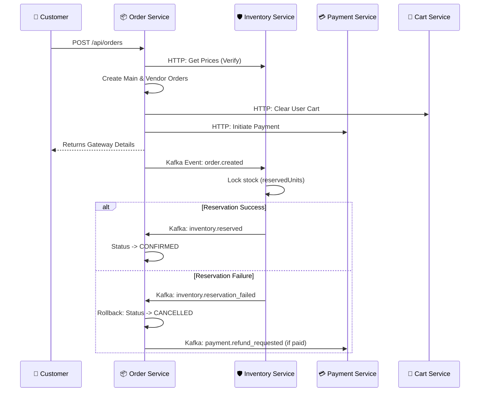

# 📦 MediGo Order Microservice

The **Order Microservice** is the central orchestrator of the MediGo ecosystem. It manages the core transactional lifecycle, ensuring high consistency across distributed components through a choreography-based **Saga Pattern**.

---

## 📽️ System Architecture

The service coordinates between the **Cart**, **Inventory**, and **Payment** services using a mix of synchronous HTTP (for validation) and asynchronous Kafka events (for fulfillment).

---

## 🚀 Premium Features

### Distributed Inventory Saga
- **Atomic Locking**: Uses a "Lock-First" strategy where stock is reserved via `reservedUnits` at order creation but only deducted at delivery.
- **Auto-Compensation**: If stock cannot be reserved or payment fails, the service automatically triggers rollbacks (releases stock, initiates refunds, cancels sub-orders).

### Resilient Payment Sync
- **ID Persistence**: Saves internal `transactionId` immediately upon initiation to prevent "ghost payments" caused by dropped frontend connections.
- **Event Correlation**: Uses Kafka to handle high-volume payment confirmations, transitioning orders to `CONFIRMED` only when cryptographically verified.

### Smart Vendor Splitting
- **Choreography**: Automatically splits customer carts into distinct orders for each pharmacy/shop.
- **Unified status**: Aggregates statuses from multiple vendor sub-orders to present a single `overAllStatus` to the customer.

---

## 📡 API Reference

### Customer Facing
| Method | Endpoint | Description | Auth |
|:---:|:---|:---|:---:|
| `POST` | `/api/orders` | Instantiate a new multi-vendor order | JWT |
| `GET` | `/api/orders/user` | Fetch personal order history | JWT |
| `GET` | `/api/orders/:id` | Detailed order summary & tracking | JWT |
| `PATCH` | `/api/orders/:id/cancel` | Cancel order & trigger automated refund | JWT |

### Internal (Service-to-Service)
| Method | Endpoint | Description | Secret |
|:---:|:---|:---|:---:|
| `GET` | `/api/internal/orders/price-validation` | Verify pricing tokens | Internal |

### Pharmacy / Vendor Support
| Method | Endpoint | Description |
|:---:|:---:|:---|
| `POST` | `/accept` | Shop accepts the sub-order |
| `POST` | `/ready` | Order packed and ready for rider |
| `POST` | `/returned` | Process physical return of items |

---

## ✉️ Event Dictionary

### Produced Topics
- **`order-events`**: Triggered on `order.created`, `order.cancelled`.
- **`vendor-order-events`**: Updates on specific shop fulfillments.

### Consumed Topics
- **`inventory-events`**: Listens for `inventory.reserved`, `inventory.reservation_failed`.
- **`payment-events`**: Listens for `payment.success`, `payment.failed`, `payment.refunded`.

---

## 🛠️ Local Development

### Prerequisites
- Node.js `v18+`
- MongoDB `v6.0+`
- Apache Kafka (configured with `order-events` and `payment-events` topics)

### Quick Start
1. **Clone & Install**: `npm install`
2. **Configure Variables**: Copy `default.env` to `.env`
3. **Run Dev**: `npm run dev`

---

## ⚖️ License
Internal MediGo Distributed Logic - (c) 2026 Core Engineering Team.
